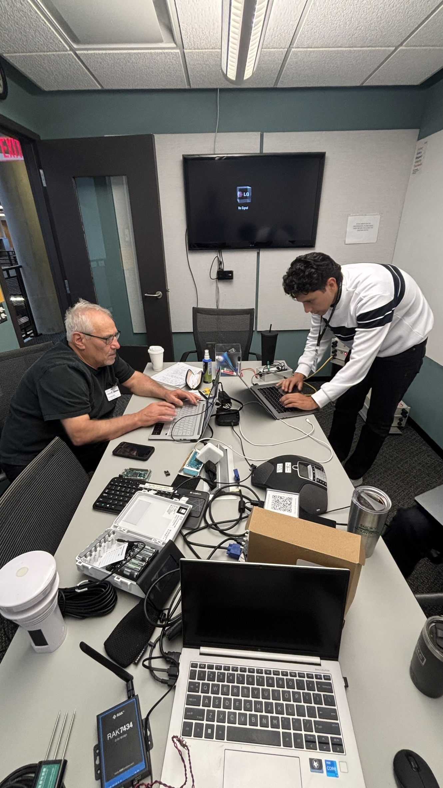
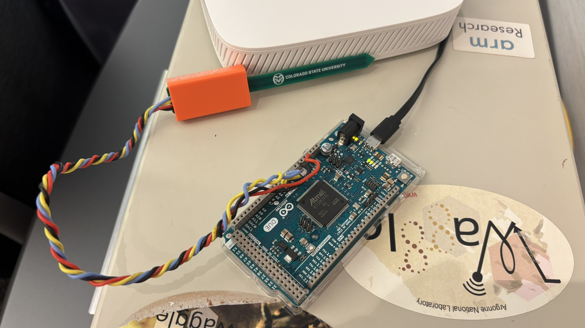

  

    
  

  Graduate students from Colorado State University partnered with researchers at Argonne National Laboratory to test Sage Devices designed for real-time environmental monitoring. They connected soil moisture sensors using both hardwired and long-range LoRaWAN configurations, demonstrating how field-based devices can process data directly at the source. These edge-computing systems enable immediate translation of raw measurements into meaningful insights.

This work is part of a broader effort to deploy an AI-enabled monitoring network across 15,000 acres at the Central Plains Experimental Range. By integrating historical datasets with live sensor inputs from soil, vegetation, and weather, the system will forecast drought, detect vegetation stress, and guide adaptive land management. The result is a scalable tool that provides ranchers, scientists, and policymakers with rapid, actionable information to support sustainable decision-making.

<!-- truncate -->

**Read more at [AI for Drought Mitigation](/use-cases/ai-drought-mitigation).**

